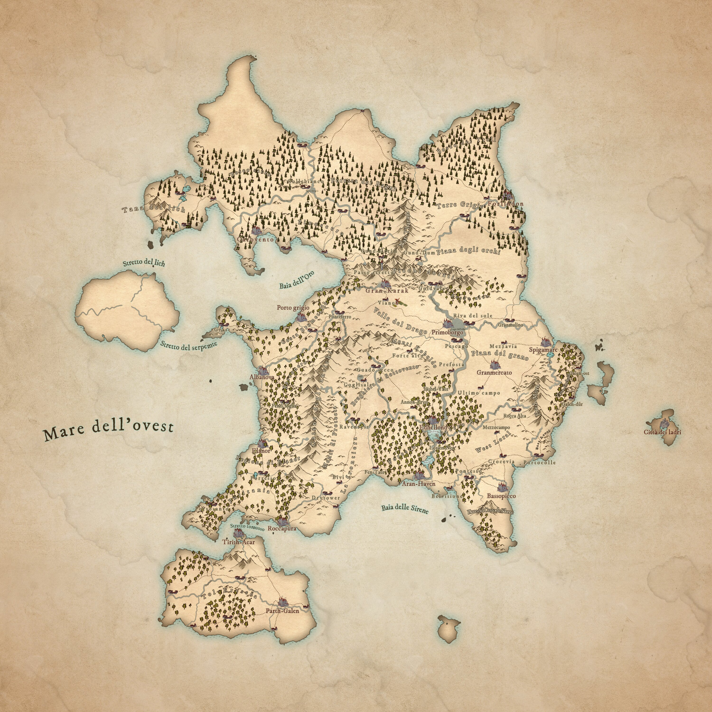

# Il Continente [Maggilia]

[← Torna al Mondo](../index.md)

---

## 🗺️ Panoramica

**Nome ufficiale:** [Maggilia]  
**Soprannome:**  
**Popolazione:** 
**Superficie:**  
**Anno attuale:** 

---

## 📜 Storia

### [Panoramica Storica](storia/storia_del_continente.md)
Storia completa generale del continente

### Timeline Principale
- **0 DE** - Era della rinascita
- **800-2063 DE** - Era delle città
- **2063-3243 DE** - Era dei grandi imperi
- **3243-3632 DE** - Era della frammentazione
- **3632-presente DE** - Era dei cambiamenti

---

## 🏛️ Stati e Unioni

### [Repubblica degli Stati Liberi](stati_e_regni/repubblica/repubblica.md)
**Capitale:** Gran-Karak  
**Governo:** Repubblica Federale  
**Popolazione:**  
**Economia:** 

**Città principali:**
- [Gran-Karak](citta/Gran-Karak.md) - Capitale
- [Porto Grigio](citta/porto-grigio.md) - Porto industriale
- [Edhellond](citta/edhellond.md) - Vecchia capitale

---

## 🗺️ Regioni
 
### Terrestri
- **Picchi Dorati** - [Dettagli](regioni/picchi-dorati.md)
- **Valle del Drago** - [Dettagli](regioni/valle-del-drago.md)
- **Costa Brumetallo** - [Dettagli](regioni/costa-brumetallo.md)

### Mari e Baie
- **Mare dell'Ovest** 
- **Mare delle sirene** 
- **Baia dell'Oro**

---

## ⚔️ Situazione Attuale

### Guerra del Grano (3817-3823 DE)
**Belligeranti:**
- Repubblica degli Stati Liberi
- Regno del Grano + alleati

**Situazione attuale:**
- Spigamare assediata da 6 mesi
- Negoziati di pace in prossimità
- Repubblica posizione dominante

[Dettagli Guerra →](eventi/guerra_del_grano_.md)

---

## 🎲 Avventure in questo Continente

### Campagna: 
**Livelli:**  
**Tema:** 
[Vai alla campagna →]()

### One-shots
- [Nome]()

---

## 📚 Risorse

### Mappe
- [Mappa Politica](mappe/Maggilia_politica_web.jpg)
- [Mappa Geografica](mappe/Maggilia_geografica_web.jpg)
- [Mappa Vie Commerciali](mappe/commerci.jpg)

---

[← Torna al Mondo](../index.md)